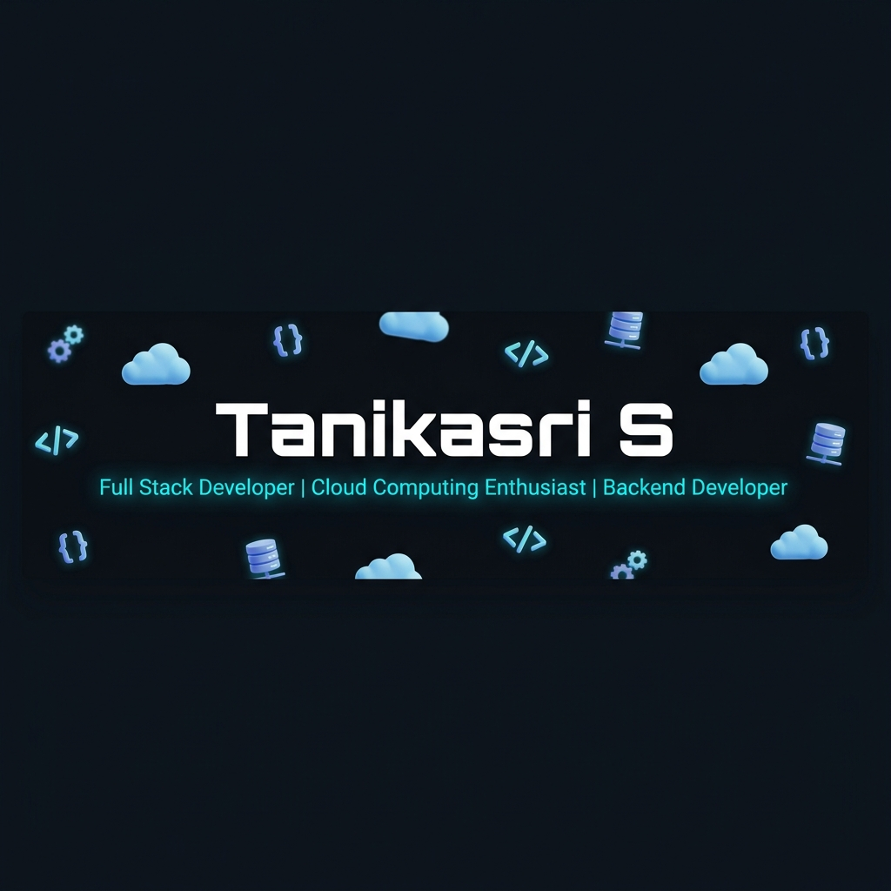
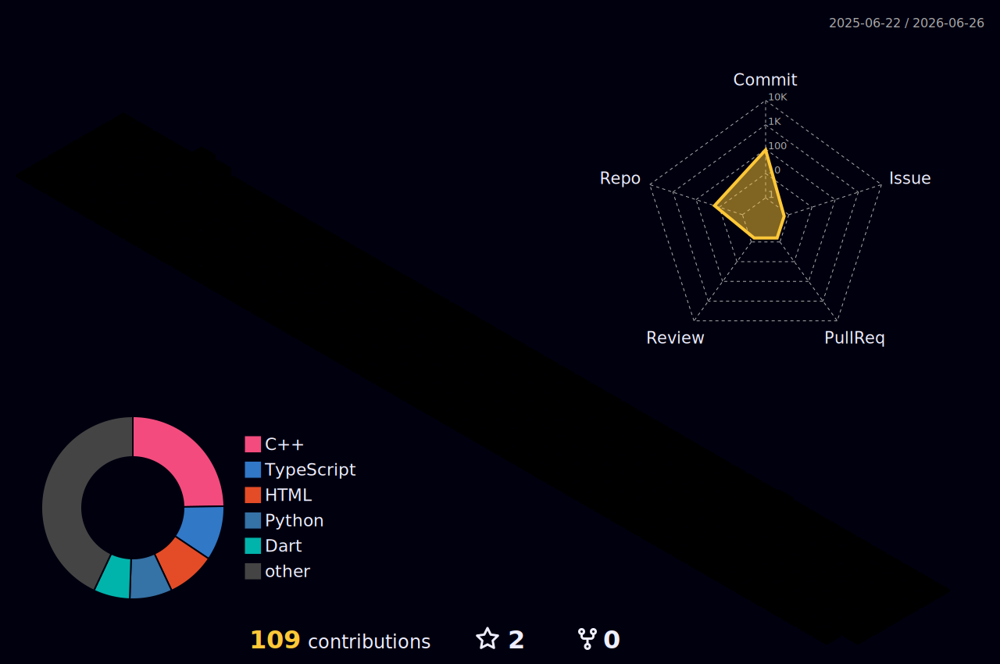

  

  
  
  

---

<table>
<tr>
<!-- Left Column: Summary and Tech Stack -->
<td valign="top" width="50%">

<h3>🏛️ Professional Summary</h3>

Computer Science Engineering student with experience in building REST APIs, Flask-based web applications, mobile apps, and cloud-enabled projects. Strong foundation in web development, backend systems, AWS, Docker, databases, and API testing. Interested in learning product security practices and building reliable, well-tested, and secure applications.

<h3>💻 Tech Stack & Expertise</h3>

<ul>
<li><b>Programming Languages:</b> 

</li>
 
<li><b>Backend & APIs:</b> 

</li>
 
<li><b>Frontend & Mobile:</b> 

</li>
 
<li><b>Cloud & DevOps:</b> 

</li>
 
<li><b>Databases:</b> 

</li>
 
<li><b>AI & Tools:</b> 

</li>
</ul>

</td>

<!-- Right Column: Contribution and Languages -->
<td valign="top" width="50%">

<h3>📊 GitHub 3D Contribution Calendar</h3>

<h3>🧮 Most Used Languages</h3>

</td>
</tr>
</table>

---

### 💼 Work Experience

**Wipro Limited** — *Intern - Power Platform and AI/ML* (Jan 2026 - Feb 2026)
- Developed enterprise applications using Power Apps to improve workflow automation, task tracking, and business process efficiency.
- Designed SharePoint-based data systems, Microsoft Excel reports, and Power BI dashboards for KPI reporting, analytics, and decision support.
- Collaborated in Agile development cycles with cross-functional teams while documenting blockers, updates, and implementation progress.
- Applied NLP, rule-based validation, and AI/ML concepts to automate employee request decision workflows.

---

### 🚀 Projects

#### 🌐 Website Change Detection System

  
  
  
  
  
  
  
  

- Engineered a scalable RESTful backend to monitor website content changes using hashing algorithms, reducing manual tracking effort by 80%.
- Structured backend services with API routing, JSON responses, modular components, and API testing for reliable business workflows.
- Designed cloud-ready metadata and storage workflows aligned with PostgreSQL/Supabase, AWS S3/DynamoDB, and Google Cloud Storage.
- Containerized all services using Docker Compose and prepared CI/CD-ready deployment workflows for GCP Cloud Run, Render, and GitHub Actions.

#### ☁️ Cloud Contact Form Application

  
  
  
  
  
  
  
  

- Built a cloud-native full-stack contact form application with a responsive frontend and secure REST API endpoints for handling user submissions and business inquiries.
- Developed backend workflows to validate form data, process requests, and trigger automated email notifications using AWS SES/API Gateway concepts.
- Deployed containerized backend services using Docker and GCP Cloud Run, enabling scalable serverless-style execution with minimal infrastructure management.
- Designed a low-maintenance cloud architecture focused on API integration, cost efficiency, reliability, and deployment readiness.

#### 🤖 AI-Driven Employee Request Validation System

  
  
  
  
  
  

- Developed an intelligent validation system to automate employee WFH, leave, and travel request checks using NLP-based text processing and rule-based business logic.
- Built REST API workflows to collect request data, validate eligibility conditions, and maintain Microsoft Excel-based request tracking and validation reports for approval analysis.
- Prepared Gemini API-style prompt workflows to generate AI-based decision explanations and support future enterprise decision-support features.

#### 🏥 MEDSEVA - Telemedicine Mobile Application

  
  
  
  
  

- Developed a healthcare application for patient records, medical report upload, profile management, and doctor appointment booking.
- Integrated Google ML Kit OCR to extract text from medical documents, reducing manual data entry by 60%.
- Used PostgreSQL concepts to manage patient records, appointment details, and doctor availability data.
- Built appointment booking and doctor availability modules to improve scheduling efficiency and healthcare accessibility.

---

### 🎓 Education

* **SRM Institute of Science and Technology** | B.Tech in CSE (Honours in FinTech) | *2023 - Present* | CGPA: **9.78**
* **Disha A Life School (ICSE)** | Class XII: **82.6%** | Class X: **84.5%**

---

### 📜 Certifications

<table>
  <tr>
    <td align="center" width="120px"></td>
    <td><b>AWS Cloud Practitioner Essentials</b></td>
  </tr>
  <tr>
    <td align="center"></td>
    <td><b>AWS Academy Graduate - Cloud Foundations</b></td>
  </tr>
  <tr>
    <td align="center"></td>
    <td><b>AWS AI/ML Scholar | IBM SkillBuild Foundational AI</b></td>
  </tr>
  <tr>
    <td align="center"></td>
    <td><b>Python Programming Certification</b></td>
  </tr>
  <tr>
    <td align="center"></td>
    <td><b>Advanced Diploma in Java Programming</b></td>
  </tr>
  <tr>
    <td align="center"></td>
    <td><b>Accenture Software Engineering Job Simulation</b></td>
  </tr>
  <tr>
    <td align="center"></td>
    <td><b>TCS iON Young Professional</b></td>
  </tr>
  <tr>
    <td align="center"></td>
    <td><b>Flutter Development Certification</b></td>
  </tr>
</table>

---

### 🏆 Achievements & Leadership

<table>
  <tr>
    <td align="center" width="50px">🥇</td>
    <td><b>Elite Batch Selection</b> (Recognized among the Top 200 students for academic excellence and technical potential)</td>
  </tr>
  <tr>
    <td align="center">🥈</td>
    <td><b>Finalist</b> - TNWISE Hackathon Startup Ecosystem (2025)</td>
  </tr>
  <tr>
    <td align="center">🥉</td>
    <td><b>Participant</b> - World Wide Technology All India Women Hackathon (2025)</td>
  </tr>
</table>

---

  

